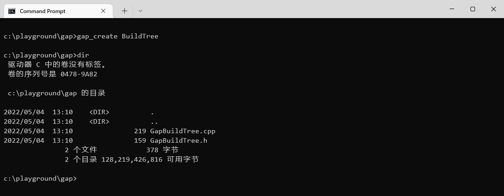

# 创建文件小工具

## 编译

```cmd
git clone git@github.com:zhuuuoyue/gap-create.git
cd gap-create
npm install
npm run dist
```

## 安装

- 将编译生成的 `dist` 文件夹拷贝到待安装的路径，如 `c:/commands/`，安装依赖
- 将 `package.json` 中的开发依赖 `devDependencies` 字段删除，拷贝到 `c:/commands` 文件夹下
- 安装依赖

```cmd
npm install
```

- 下载 `node.exe` 放到 `d:/commands` 文件夹下
- 将路径 `c:/commands` 添加到环境变量
- 在 `c:/commands` 下添加批处理文件 `gap_create.bat`

```cmd
@echo off
set oldPath=%cd%
cd /d %~dp0
"./node.exe" "./dist/main.js" --destination %oldPath% --className %1 --files %2 %3 %4
cd /d %oldPath%
```

## 使用

在用户文件夹下，新建 `.gap_create` 文件夹，新建配置文件 `author_info.json`，添加以下内容。

```json
{
  "owner": "zhangcs",
  "co_owner": "zhangwj"
}
```

在任意位置启动命令行工具，即可使用 `gap_create` 命令创建文件。


